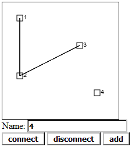

# CanvasGraph
Simple graphs editor based on HTML5 canvas

Графом називають упорядковану пару (V, E), де V - множина об’єктів (вершин), а  E - множина пар об’єктів (ребер). Графи широко використовуються для представлення структур різноманітних систем. Існує чимало програм для редагування графів, але зазвичай їх важко адаптувати для використання у веб-застосунках - клієнт-серверних програмах, у яких клієнтом є браузер, а сервером - веб-сервер. Метою цієї роботи є розробляння веб-застосунку для інтерактивного редагування графів з можливістю його простої модифікації для конкретного завдання. Опишемо принципи його роботи. Сценарій мовою JavaScript рисує граф за допомогою HTML5-елемента canvas, який призначений для створення растрового двовимірного зображення за допомогою сценаріїв:
```html
<canvas id="canvas" width="200" height="200" ></canvas>
```
Наступний код JavaScript отримує доступ до об’єктів canvas і context, додає обробку подій миші для можливості вибору і переміщення вершин, рисує вершину графа KB[i] та ребро графа між вершинами KB[i] і KB[k]:
```javascript
var canvas = document.getElementById("canvas");
var context = canvas.getContext("2d");
canvas.addEventListener('mousemove', f1); canvas.addEventListener('click', f2);
context.strokeRect(KB[i].x, KB[i].y, 10, 10);
context.moveTo(KB[i].x+5, KB[i].y+5); context.lineTo(KB[k].x+5, KB[k].y+5);
context.stroke();
```
Тут граф описується за допомогою асоціативного масиву KB. Наприклад наступний об’єкт описує граф, показаний на рис. В ньому ключі "1", "2", "3", "4" означають назви вершин, а ключі "x", "y", "s", "n" - координати, стан вибору і список сусідніx вершин ребер відповідно.
```javascript
KB = {
"1": {"x":10, "y":10, "s":0, "n":["2"]},
"2": {"x":10, "y":60, "s":0, "n":["3"]},
"3": {"x":60, "y":30, "s":0, "n":[]},
"4": {"x":80, "y":80, "s":0, "n":[]}
}
```


Візуалізація графа KB в браузері

Програма-сервер мовою Python зберігає модифікований граф у постійній пам'яті сервера та виконує додаткові алгоритми для обробки графа, які важко реалізувати на стороні клієнта. Наприклад може бути використана Python-бібліотека NetworkX для реалізації різних алгоритмів на графах. Взаємодія клієнта і сервера організована за допомогою інтерфейсу XMLHttpRequest. XMLHttpRequest - це клас JavaScript, який дозволяє виконувати HTTP запити до сервера без перевантаження сторінки в браузері. Наприклад відправити дані про модифікацію графа серверу може наступний сценарій мовою JavaScript:
```javascript
var xmlhttp = new XMLHttpRequest(); xmlhttp.open('POST', '/', false);
var s=JSON.stringify(KB); xmlhttp.send("KB="+s+";c="+c);
```
Після обробки даних сервер надсилає клієнту дані, які можна отримати з властивості xmlhttp.responseText.
Наступний код показує як можна просто створити веб-сервер мовою Python. Тут функція application отримує запити клієнтів, обробляє їх та повертає відповідь сервера. Дані між клієнтом і сервером передаються у текстовому форматі JSON.
```python
from wsgiref.simple_server import make_server
make_server('localhost', 80, application).serve_forever()
```
Програму можна завантажити з каталогу пакетів Python https://pypi.python.org/pypi/CanvasGraph. Вона може бути використана на локальному комп'ютері або адаптована для використання у веб. Автори планують використовувати програму для побудови схем моделей динамічних систем та баз знань на основі семантичних мереж.
